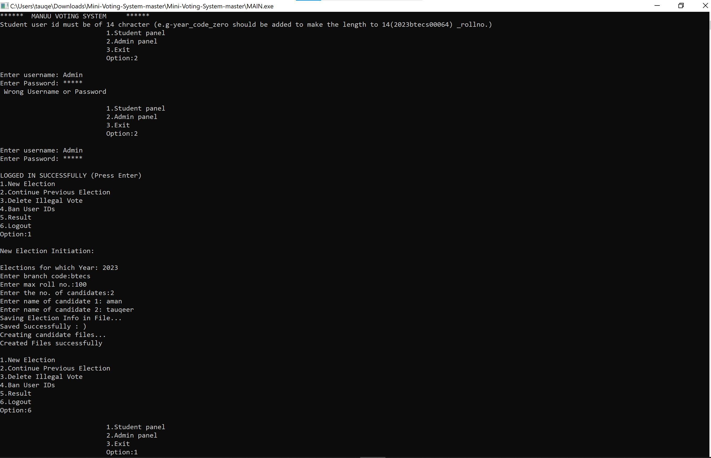

# MANUU-VOTING-SYSTEM
It's a Voting sytem using C language  
For Admin Panel Use Username: "Admin" Password: "admiN"

# You can fork or download the repo, Once you have both the files "MAIN.C" and "ELECTION.H", You just need to compile and run MAIN.C
